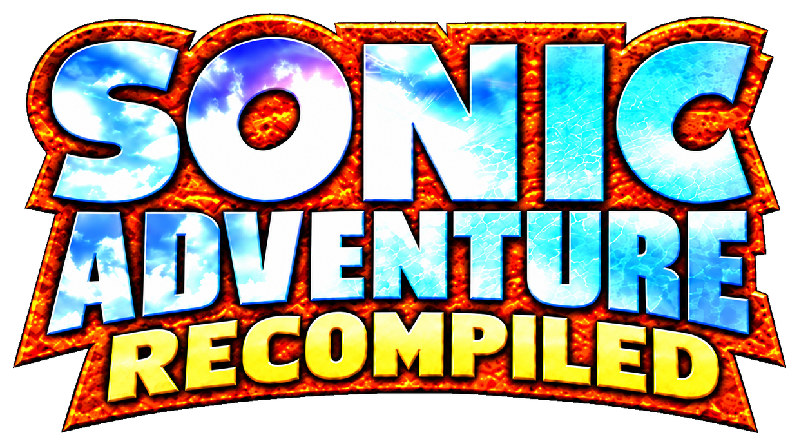

  

  <strong>The Dreamcast adventure, recompiled for PC.</strong> 
  Windows &nbsp;·&nbsp; Linux &nbsp;·&nbsp; Steam Deck

  <a href="https://github.com/sonicfreak1337/SARecomp/releases/tag/v0.50.0-beta.1">Download Beta 1</a> &nbsp;·&nbsp;
  <a href="#installation">Installation</a> &nbsp;·&nbsp;
  <a href="#features">Features</a> &nbsp;·&nbsp;
  <a href="#known-issues">Known issues</a> &nbsp;·&nbsp;
  <a href="https://github.com/sonicfreak1337/SARecomp/issues/new/choose">Report a bug</a>

---

Sonic Adventure Recompiled is an unofficial native PC port of the Dreamcast
version of **Sonic Adventure**, powered by **KatanaRecomp**. It preserves the
original adventure while adding widescreen support, modern camera controls, native
PC settings and a choice of rendering and gameplay timing modes.

**You must provide your own copy of Sonic Adventure.** The installer requires
the supported **PAL v1.003 (1999)** disc image and its accompanying tracks.
Original gameplay files are installed from your disc data, not supplied in the
player installer. See [supported game files](docs/INSTALLATION.md#supported-game-files).

> [!NOTE]
> **First release — work in progress.** This is a beta release.
> **The game is fully playable**, with all seven stories playable from start to
> finish. Further work focuses on polish, compatibility and performance.

## Installation

Download **[v0.50.0-beta.1](https://github.com/sonicfreak1337/SARecomp/releases/tag/v0.50.0-beta.1)**,
choose the installer for your platform and follow the on-screen setup.
**Setup is in English.** In-game text and voice languages can be changed in Options.

| Platform | Package | Getting started |
| --- | --- | --- |
| Windows | Windows installer (`.exe`) | Run setup, select your `.gdi`, then launch **Sonic Adventure Recompiled**. |
| Linux | Linux installer (`.run`) | Make it executable and run it as your normal user. No `sudo` is needed. |
| Steam Deck | Steam Deck installer (`.run`) | Install in **Desktop Mode**, then add the installed game to Steam. Use Gaming Mode to play; do not force Proton. |

Keep the `.gdi` and **all of its track files together**, with the filenames
referenced by the descriptor. Extract archives before selecting the game files.

**[Full installation guide and disc hashes →](docs/INSTALLATION.md)**

Player installers, checksums and installation instructions are on the
[Releases page](https://github.com/sonicfreak1337/SARecomp/releases).
GitHub's source-code ZIPs are not player installers.

## Features

### Widescreen and native rendering

- Original **4:3**, **16:9** and **21:9**, plus the display's actual aspect ratio.
- Wider world rendering with correctly proportioned HUD elements at the screen edges.
- **Direct3D 11 or Vulkan** on Windows; **Vulkan** on Linux and Steam Deck.
- Windowed, borderless and fullscreen modes on PC, with **Alt+Enter** switching.
- Steam Deck handheld preset: **1280 × 800**, native **16:10**, fullscreen.
  Docked mode supports compatible external display resolutions and aspect ratios.

### Original or Recompiled

**Original timing** retains the game's scene-dependent cadence.
**Recompiled timing** targets 60 gameplay updates per second at the original
intended game speed. VSync controls presentation against the display's refresh rate.
Actual performance depends on the scene and hardware.

**Original camera** keeps the original behavior. The optional **Recompiled
camera** adds right-stick orbit and vertical control, with mouse camera support,
separate sensitivities, inversion, deadzones and a configurable return to the
original camera. Cutscenes and scripted camera sequences retain their control.

### Options that fit the game

A new in-game Options menu follows the original presentation and keeps the
original Options music and **Sound Test**. Navigate with a controller, mouse
or keyboard. Settings that need a restart are marked; display changes have a
confirmation timeout and automatic rollback.

- Rebind controls and choose Xbox, PlayStation or keyboard button prompts.
- Adjust master, music, voice and effects volumes separately.
- Optionally mute or pause on focus loss, and pause on controller disconnection.
- Select Japanese, English, French, Spanish or German text; Japanese or English voices.
- Manage save profiles, versioned backups, restores and save import/export.
  Story and Chao data are backed up together, with confirmation before replacement.
- At the title screen, press **B / Circle / Escape** to open the quit confirmation.

## System requirements

| Platform | Current requirements |
| --- | --- |
| Windows | x64 PC with a Direct3D 11-capable GPU, or a Vulkan 1.3-capable GPU and driver for Vulkan. |
| Linux | 64-bit Linux with a Vulkan 1.3-capable GPU and driver. See compatibility notes below. |
| Steam Deck | SteamOS; use the Steam Deck package and install in Desktop Mode. |

**Linux compatibility:** the Linux installer is intended for **Linux Mint
(including Cinnamon), Ubuntu and other compatible 64-bit distributions**.
No particular desktop environment is required. The technical minimum is
**x86-64, glibc 2.31+ and X11 or XWayland**. Installer checks currently use our
Linux VM; Mint has not yet been tested separately.

CPU, memory and storage recommendations for a final release are still being
measured. Setup checks the required installation space. Allow additional room
for the source disc files, temporary extraction and update backups.

## Known issues

- **Steam Deck launch mode:** starting the game in Desktop Mode can freeze
  the Steam Deck. **Install in Desktop Mode, but always launch the game through
  Steam Gaming Mode.**
- **Steam Deck performance:** for the best current experience, set
  **Game timing → Original** and **VSync → Off** in Options. Demanding stages,
  bosses and cutscenes can still slow down. Further performance improvements are planned;
  stable 60 FPS across the whole game is not yet established.
- **Widescreen cutscenes:** some scenes and effects can expose framing issues
  outside the original 4:3 area. This is confirmed in **Tails' first cutscene**.
  Original 4:3 remains available as a workaround.
- **Stability:** bugs and isolated crashes may still occur. Please report
  reproducible problems so they can be investigated.

Check [existing reports](https://github.com/sonicfreak1337/SARecomp/issues)
before opening a [bug report](https://github.com/sonicfreak1337/SARecomp/issues/new/choose).
Include the version, platform, character, stage and steps to reproduce. If reporting
performance, distinguish the game's **SIM FPS** from an external display FPS overlay.
Diagnostic reports are optional; do not attach original game files or personal saves.

## FAQ

**Can I use Sonic Adventure DX or another Dreamcast release?** 
No. The current installer supports the specific PAL Dreamcast release listed
in the [installation guide](docs/INSTALLATION.md#supported-game-files).

**Does the game run through an emulator or Proton?** 
The port uses native compiled code and native rendering. Linux and Steam Deck
builds run directly; leave Steam's forced compatibility-tool setting disabled.

**Will reinstalling remove my progress?** 
Reinstalling preserves saves and settings. Close the game before running setup.
Save backups can also be created from **Options → Profiles**.

**How do I build or contribute?** 
See [development setup](docs/DEVELOPMENT.md) and [contributing](CONTRIBUTING.md).
Playing a release build does not require building the project.

## Credits

**Original game created by SEGA, 1998, 1999.** 
**Port created by SoNiCFReaK, 2026.** 
**Powered by KatanaRecomp.**

**Development disclosure:** AI tools were used as coding assistants during
the development of this port.

Additional software and license notices are documented under
[third-party dependencies](third_party/README.md) and included with the packages.

**This is an independent, non-profit fan project. Sonic Adventure and its
original characters, game content and trademarks belong to SEGA.**
This project is not affiliated with, sponsored by or endorsed by SEGA.
